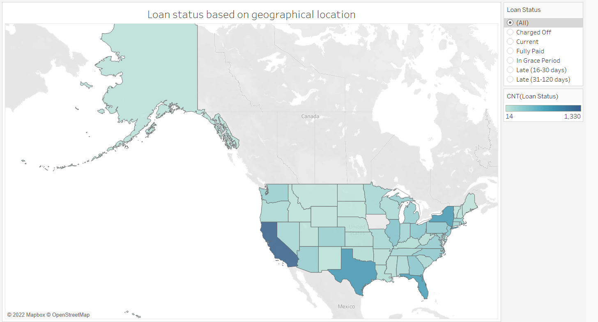
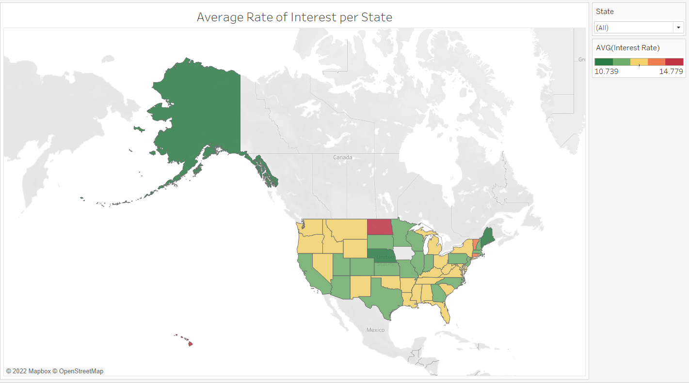
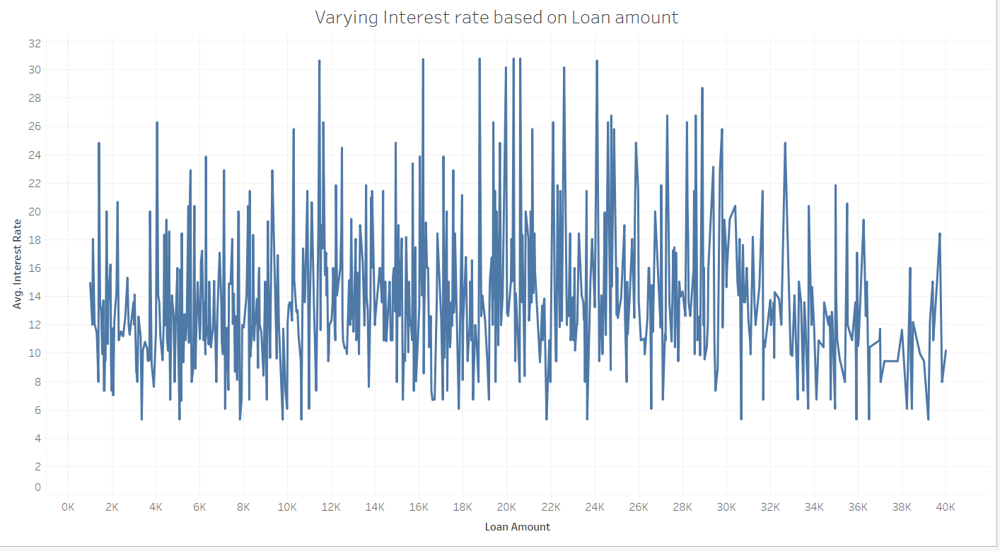
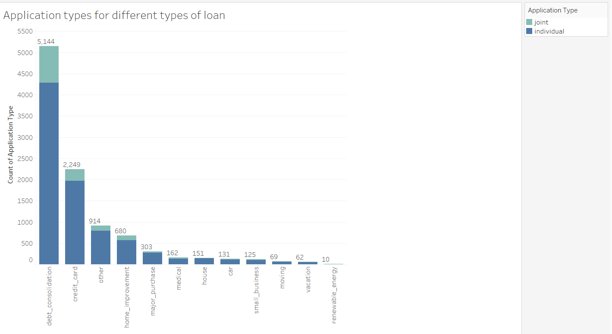

# Analysis-on-a-lending-club-platform

Dataset Link 

https://www.openintro.org/data/index.php?data=loans_full_schema

Link to the visualizations 

https://public.tableau.com/app/profile/nikita.goel/viz/casestudy1_16497261047750/visualization1_1

Tableau desktop file can be found in the "visualization" folder. 

Visualization 1: Is there any relationship between average annual income and loan interest rates?

Visualization 2: Which state to give attention regarding different loan statuses 

Visualization 3: Visualizing the interest rate per state 

Visualization 4: Plotting the interest rate variation based on the loan amount

Visualization 5: Distribution of applications over different types of loan

